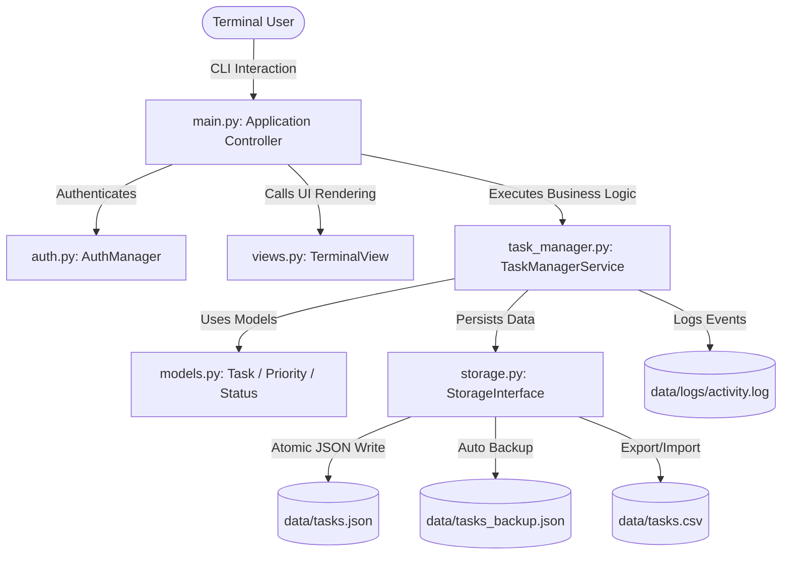
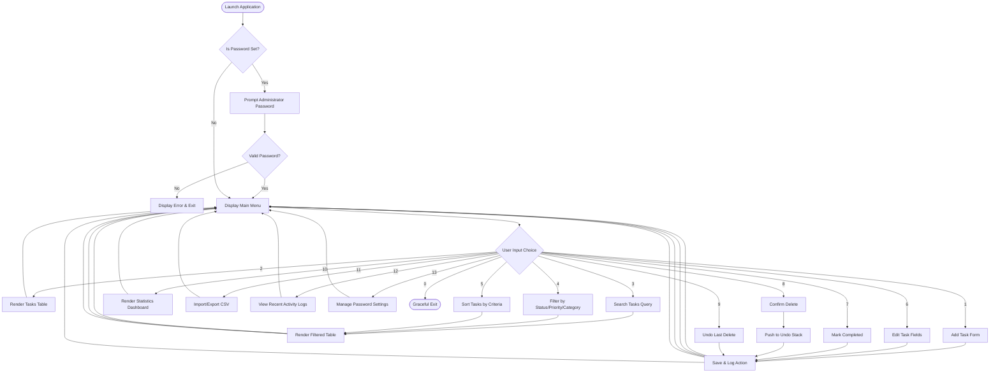
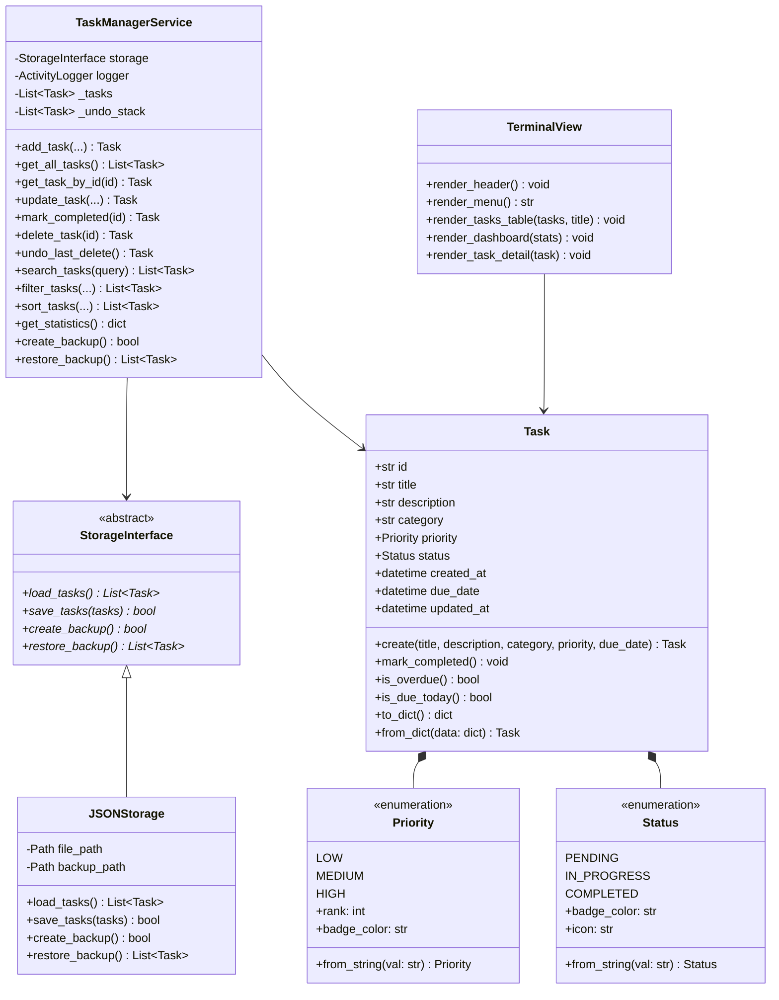
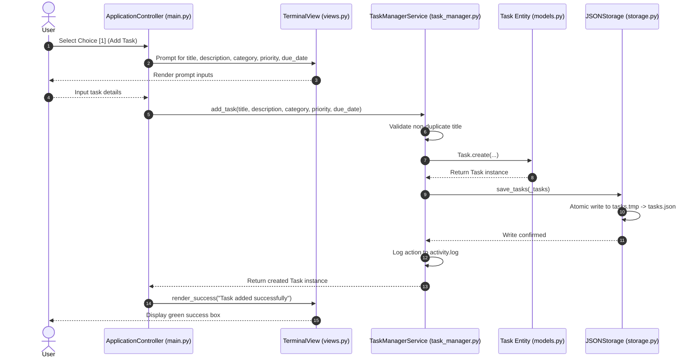

# System Architecture & Engineering Diagrams

This document contains Mermaid diagrams illustrating the structural design, runtime data flow, UML class relations, and sequence interactions of `TaskManager`.

---

## 1. High-Level Architecture Diagram

---

## 2. Application Flowchart

---

## 3. UML Class Diagram

---

## 4. Sequence Diagram (Task Creation Flow)

